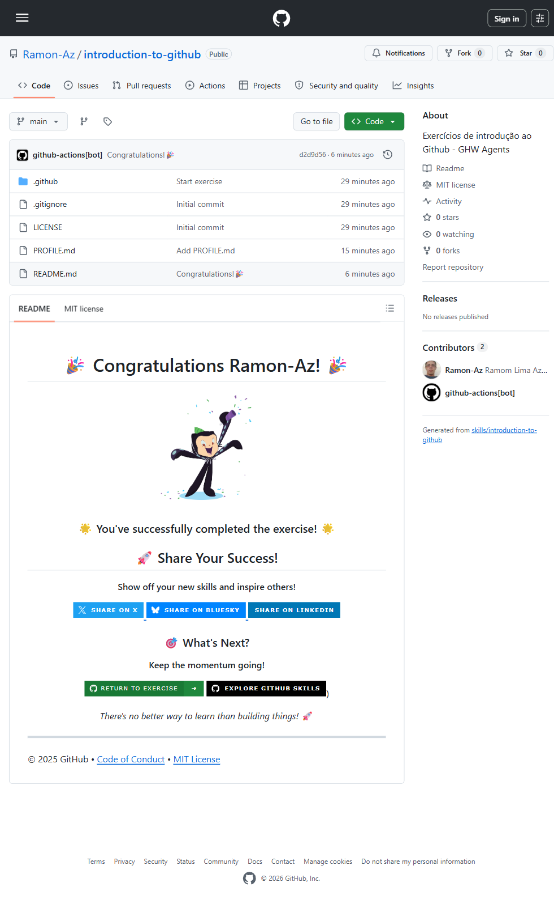

# Desafio 1: Introduction to GitHub (GitHub Skills)

## 📋 O que foi feito

Conclusão do curso **Introduction to GitHub** do GitHub Skills. O exercício guiou através dos fundamentos do GitHub:

- Criação de branch
- Commit de arquivo
- Abrir Pull Request
- Merge do PR

Ao final, o repositório ficou com a mensagem de conclusão: **"You've successfully completed the exercise!"**

## 📁 Estrutura do repositório

```
Ramon-Az/introduction-to-github
- README.md (seu profile README)
- PROFILE.md
- LICENSE (MIT)
- .gitignore
- .github/workflows/ (workflow do curso)
```

## 🔗 Link do repositório

https://github.com/Ramon-Az/introduction-to-github

## 🎯 Evidência



*Print do topo do repositório mostrando a mensagem "Congratulations Ramon-Az! You've successfully completed the exercise!"*

## 📝 Submissão no GHW Agents

Para subir na plataforma MLH:

1. **Link:** https://github.com/Ramon-Az/introduction-to-github
2. **Evidence:** Screenshot do topo do repo mostrando a mensagem de conclusão (ou o print ao lado)

## 📦 Como capturar o print (para submissão)

Quando for submeter no ghw.mlh.io, tire um print do topo do repositório que mostre:

- A mensagem **🎉 Congratulations Ramon-Az! 🎉**
- Ou o badge **🌟 You've successfully completed the exercise! 🌟**

Salve o print em: `desafio1_github-skills/assets/img/01-introduction-to-github-conclusion.png`

---

*Pasta criada em 12/08/2026 para registro do desafio GitHub Skills no Hackathon MLH Global Hack Week 2026.*