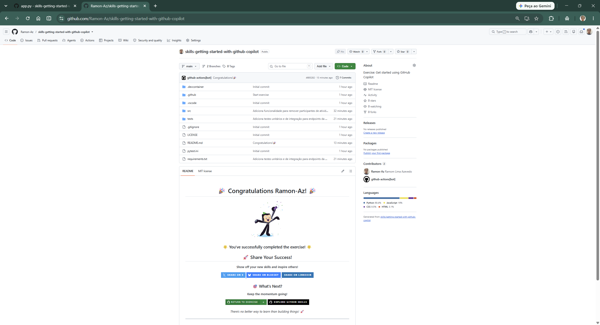
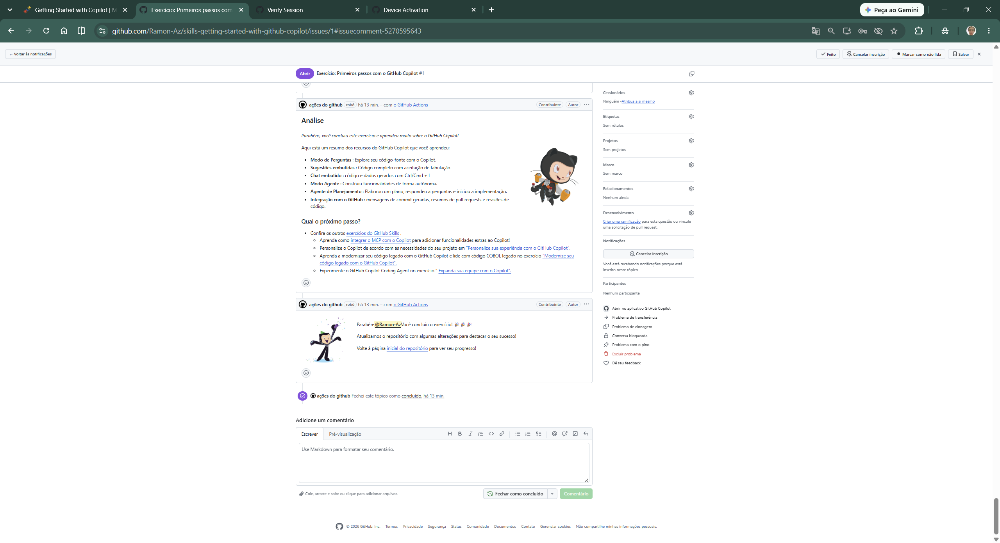

# Desafio 2: Getting Started with Copilot (GitHub Skills)

## 📋 O que foi feito

Conclusão do curso **Getting Started with Copilot** do GitHub Skills. O exercício guiou através dos fundamentos do GitHub Copilot:

- Utilizar Codespace pré-configurado para VS Code no navegador
- Aprender diferentes opções de interação com o Copilot (Ask mode, Edit mode, Inline Chat)
- Usar o Copilot para resumir e revisar Pull Requests
- Guiar o Copilot para atualizar o site da Mergington High School

✅ **Concluído** em 12/08 — 1 challenge do GHW Agents somado (de 7/11 para 8/11)

Ao final, o repositório ficou com a confirmação de conclusão do curso GitHub Skills.

## 📁 Estrutura do repositório

```
seu-perfil/skills-getting-started-with-github-copilot
- Arquivos do Codespace (gerados automaticamente)
- .github/workflows/ (workflow do curso)
- Atividades concluídas com Copilot (commits, branches, PRs)
```

## 🔗 Link do repositório

https://github.com/Ramon-Az/skills-getting-started-with-github-copilot

*(Substitua `seu-usuario` pelo seu nome de usuário GitHub após copiar o exercise)*

## 🎯 Evidência


*Print do topo do repositório mostrando a mensagem de conclusão do GitHub Skills*

---



*Print final da atividade com a análise de conclusão*
## 📝 Submissão no GHW Agents

Para subir na plataforma MLH:

1. **Link:** O link do seu repo `skills-getting-started-with-github-copilot` (copiado do template)
2. **Evidência:** Screenshot do topo do repo mostrando a conclusão do curso (ou o print ao lado)

## 📦 Como capturar o print (para submissão)

Quando for submeter no ghw.mlh.io, tire um print do topo do repositório que mostre:

- A mensagem de conclusão do GitHub Skills
- Ou o badge de conclusão do exercise

Salve o print em: `desafio2_github-skills/assets/img/02-getting-started-with-copilot-conclusion.png`

---

*Pasta criada em 12/08/2026 para registro do desafio GitHub Skills no Hackathon MLH Global Hack Week 2026.*