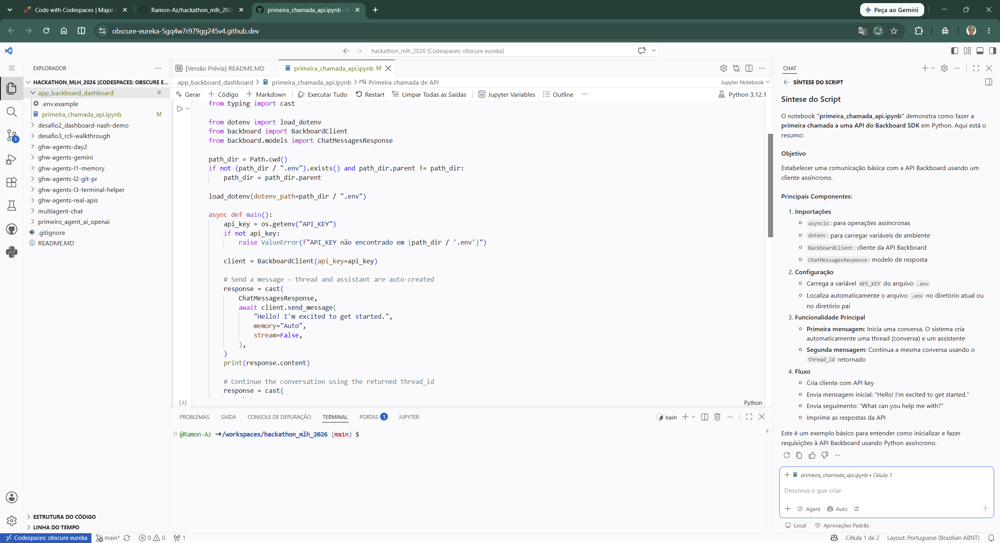

# GitHub Skills: Code with Codespaces

## Concluído em: 12/08

Conclusão do terceiro curso do GitHub Skills do Global Hack Week Agents 2026.

### O que foi aprendido

- Como criar e configurar um ambiente de desenvolvimento no GitHub Codespaces
- Uso básico do VS Code no navegador
- Navegação entre arquivos e edição direta no navegador
- Comandos essenciais no ambiente cloud

### Estrutura

```
desafio3_github-skills-codespace/
├── README.md           # Este arquivo
├── assets/
│   └── img/
│       └── 01-github-codespace.png  # Evidência de conclusão
```

### Evidências



### Link de Submissão

Submetido no GHW Agents 2026 em 12/08.

---

Parte do repositório [hackathon_mlh_2026](https://github.com/Ramon-Az/hackathon_mlh_2026).