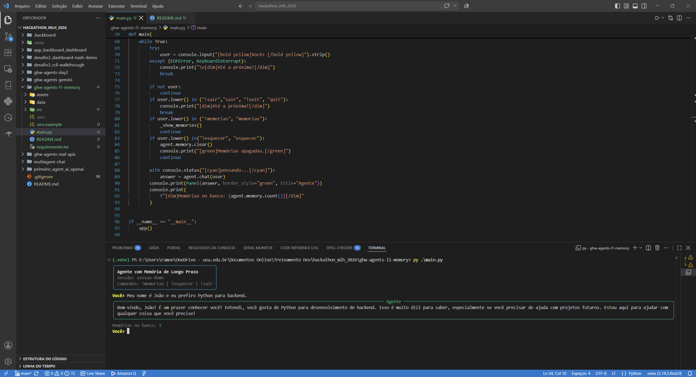
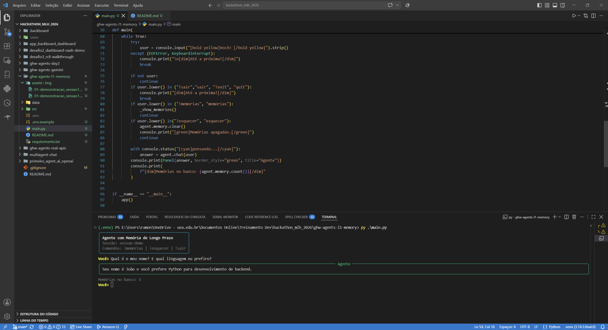
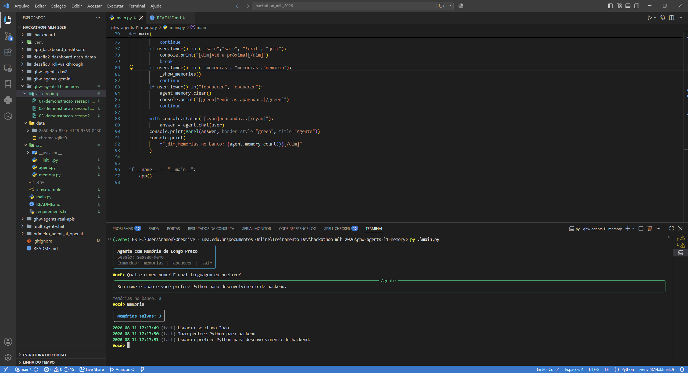

# L1 — Agente com Memória de Longo Prazo (Give Your Agent Long-Term Memory)

Desafio livre do **MLH Global Hack Week Agents 2026**: criar um agente que memorize as
preferências do usuário ou interações anteriores **entre sessões**, usando um banco de
dados ou **armazenamento vetorial** (ChromaDB).

## 🧠 O que o agente faz
- **Lembra entre sessões:** feche o programa, abra de novo — ele ainda sabe seu nome,
  preferências e fatos ditos antes.
- **Memória semântica:** um LLM extrator analisa cada conversa e transforma o que é útil
  em fatos duráveis (ex.: "Usuário prefere Python para backend").
- **Recall por similaridade:** antes de responder, o agente busca no banco vetorial as
  memórias relevantes (não é busca por palavra-chave — é similaridade semântica).
- **Ferramentas nativas:** o próprio modelo decide quando salvar (`salvar_memoria`) e
  quando consultar (`buscar_memoria`) via function calling.

## 🏗️ Arquitetura
| Camada | Implementação |
|--------|---------------|
| Agente | Python + OpenAI SDK apontando para **Groq** (`llama-3.3-70b-versatile`) |
| Memória de longo prazo | **ChromaDB** (armazenamento vetorial persistente em `data/`) |
| Embeddings | modelo local `all-MiniLM-L6-v2` (via ONNX, ~80MB, sem custo, sem PyTorch) |
| Interface | CLI com **typer + rich** |

Fluxo de cada mensagem:
```
usuário -> [buscar memórias relevantes no ChromaDB] -> [injetar no system prompt]
        -> LLM (Groq) -> pode chamar tools (salvar/buscar memória)
        -> resposta -> [LLM extrator extrai fatos novos] -> [grava no ChromaDB]
```

## 🚀 Como rodar
```bash
# 1. instalar dependências (no .venv do repo)
pip install -r requirements.txt

# 2. configurar chave
cp .env.example .env   # preencha GROQ_API_KEY

# 3. iniciar o chat
python main.py
```

Comandos no chat:
- `!memorias` — lista tudo que está salvo no banco vetorial
- `!esquecer` — apaga todas as memórias
- `!sair` — encerra

## 🎬 Demonstração (evidência)
**Sessão 1:**
```
Você> Meu nome é João e eu prefiro Python para backend.
Agente> Oi João! Entendi que você gosta de Python para desenvolvimento backend...
```

**Fecha o programa.**

**Sessão 2 (processo novo, mesma pasta `data/`):**
```
Você> Qual é o meu nome? E qual linguagem eu prefiro?
Agente> Seu nome é João e você prefere a linguagem Python para desenvolvimento backend.
```

**Evidências (prints reais):**







## 📌 Lições aprendidas
- **ChromaDB** é um armazenamento vetorial de verdade (coleções, metadados, busca por
  cosseno) e resolve embeddings localmente via ONNX — sem precisar de PyTorch.
- **Memória semântica ≠ log de conversa:** guardar fatos extraídos (curtos, objetivos)
  deixa o recall muito mais preciso que salvar o transcript inteiro.
- **Dedup:** o modelo tende a salvar o mesmo fato com variações — filtrar por similaridade
  (distância < 0.15) evita memória poluída.
