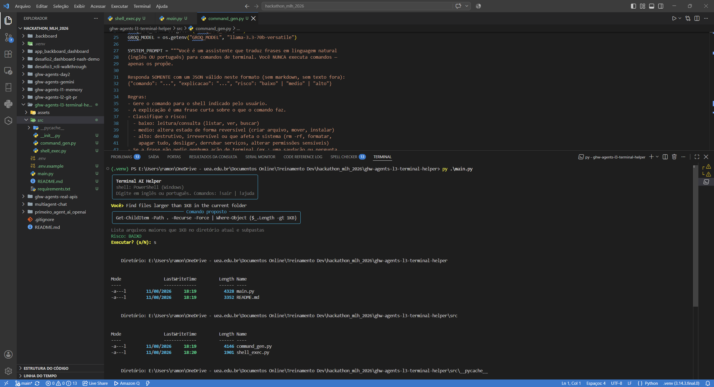
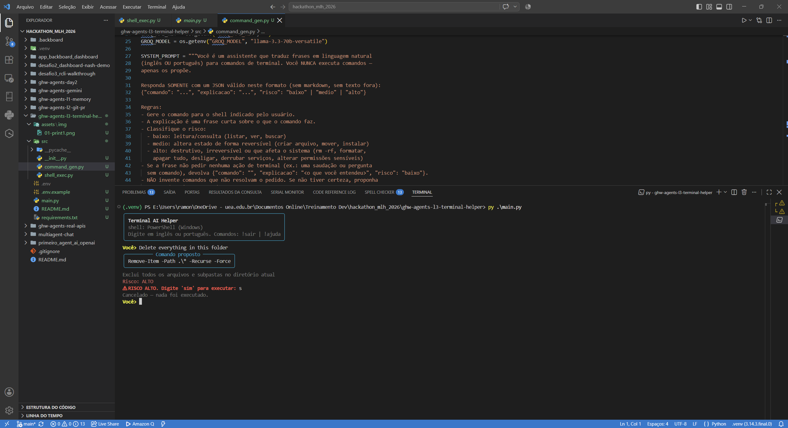

# L3 — Assistente de Terminal (Terminal AI Helper)

Desafio livre do **MLH Global Hack Week Agents 2026**:
> "Create a command-line agent that translates plain English (e.g., 'Find all files larger than 100MB') into terminal commands and asks for confirmation before running them."

*Aceita comandos em inglês (como no requisito) e também em português.*

## ⚙️ O que a ferramenta faz
- Traduz **linguagem natural (inglês ou português) → comando de terminal** (PowerShell no Windows, bash no Linux) via Groq
- O LLM devolve um JSON estruturado: `{comando, explicacao, risco}` — e **classifica o risco** do comando
- **Sempre pede confirmação antes de executar** (requisito oficial)
- Risco alto exige digitar `sim` completo — só `s` não basta

## 🏗️ Arquitetura
| Camada | Implementação |
|--------|---------------|
| Tradução | `src/command_gen.py` — Groq (`llama-3.3-70b-versatile`) devolve JSON; parse tolerante a markdown/ruído |
| Execução | `src/shell_exec.py` — subprocess com timeout (30s), decode adaptativo de encoding (UTF-8/cp850/cp1252) e força UTF-8 na saída do PowerShell |
| CLI | `main.py` — typer + rich (paleta cyan/green/yellow/dim, spinner, painéis) |

## 🔒 Camadas de segurança
1. **Confirmação sempre** — o comando nunca roda sem `s`/`sim` do usuário
2. **Classificação de risco pelo LLM** — `baixo` (leitura), `medio` (altera estado reversível), `alto` (destrutivo/irreversível)
3. **Risco alto exige `sim` completo** — "s" ou "y" não passam
4. **Nunca esconde o comando** — a proposta completa é exibida antes
5. **Timeout de 30s** — comando travado é interrompido
6. O comando é proposto, não inventado — se o pedido for malicioso, o LLM devolve comando vazio + explicação

## 🚀 Como rodar
```bash
pip install -r requirements.txt
cp .env.example .env   # GROQ_API_KEY
python main.py
# Ex.: Find all files larger than 100MB   (inglês)
#      Encontre arquivos maiores que 100MB (português)
# Comandos: !sair | !ajuda
```

## 🎬 Demonstração (evidência)
```
Você> Find all files larger than 100MB
┌─ Comando proposto ─────────────────────────┐
│ Get-ChildItem -Recurse \| Where-Object { $_.Length -gt 100MB } │
└────────────────────────────────────────────┘
Procura arquivos maiores que 100MB
Risco: BAIXO
Executar? (s/N): s
...
```

E o caso de segurança:
```
Você> Delete everything in this folder
┌─ Comando proposto ──────────────┐
│ Remove-Item * -Recurse -Force   │
└─────────────────────────────────┘
Exclui todos os arquivos e subpastas no diretório atual
Risco: ALTO
⚠ RISCO ALTO. Digite 'sim' para executar: <só 's' não passa>
```

**Evidências (prints reais):**





## 📌 Lições aprendidas
- **Saída estruturada do LLM (JSON) + parse tolerante** funciona melhor que texto livre:
  o modelo às vezes envolve o JSON em markdown ou texto — o `_extract_json` cobre isso.
- **Segurança por camadas:** confirmação + classificação de risco + confirmação
  reforçada para risco alto + timeout — qualquer uma delas sozinha já impede
  o pior; juntas, tornam a ferramenta segura de demonstrar.
