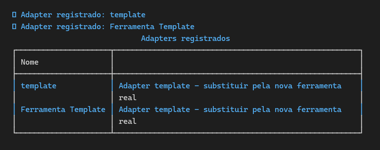
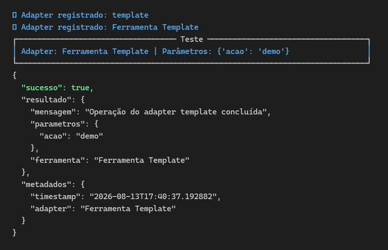

# L6 — Project Using a New Tool

Desafio livre do **MLH Global Hack Week Agents 2026**:
> "Create an agent that uses a new tool — something you've never used before — and document what you learned."

**Nova ferramenta usada:** padrão **Adapter** (design pattern) + registry/factory para integração plugável de ferramentas.

## ⚙️ O que a ferramenta faz
- Implementa o **padrão Adapter** para conectar novas ferramentas ao agente de forma consistente
- **Registry** com descoberta por nome: `registrar_adapter()`, `obter_adapter()`, `listar_adapters()`
- **Factory** `criar_adapter()` cria instâncias a partir do nome + config
- CLI para listar, testar e registrar adapters — com registro automático do template

## 🏗️ Arquitetura
| Camada | Implementação |
|--------|---------------|
| Adapter base | `src/nova_ferramenta.py` — `NovaFerramentaAdapter` (ABC: `executar()`, `validar()`, `nome`, `descricao`) |
| Exemplo | `AdapterTemplate` — implementação concreta com execução estruturada (JSON) |
| Registry/Factory | `registrar_adapter` / `obter_adapter` / `listar_adapters` / `criar_adapter` |
| CLI | `main.py` — typer + rich (listar/testar/registrar) |

## 🚀 Como rodar
```bash
pip install -r requirements.txt

# Listar adapters registrados
python main.py listar

# Testar um adapter com parâmetros JSON
# (PowerShell: use --% para não "comer" as aspas do JSON)
python main.py testar "Ferramenta Template" --% "{\"acao\": \"demo\"}"
# (Linux/macOS: python main.py testar "Ferramenta Template" '{"acao": "demo"}')

# Registrar um novo adapter (exemplo)
python main.py registrar
```

> **Windows:** `$env:PYTHONIOENCODING='utf-8'` para emojis no console.

## 🎬 Demonstração (evidência)
```
$ python main.py listar
🔧 Adapter registrado: template
🔧 Adapter registrado: Ferramenta Template
┌─ Adapters registrados ──────────────────────────────────────────┐
│ template            │ Adapter template - nova ferramenta real   │
│ Ferramenta Template │ Adapter template - nova ferramenta real   │
└─────────────────────────────────────────────────────────────────┘

$ python main.py testar "Ferramenta Template" --% "{\"acao\": \"demo\"}"
┌─ Teste ───────────────────────────────────────────────┐
│ Adapter: Ferramenta Template | Parâmetros: {'acao': 'demo'} │
└────────────────────────────────────────────────────────┘
{
  "sucesso": true,
  "resultado": {
    "mensagem": "Operação do adapter template concluída",
    "parametros": {"acao": "demo"},
    "ferramenta": "Ferramenta Template"
  },
  "metadados": {
    "timestamp": "2026-08-13T...",
    "adapter": "Ferramenta Template"
  }
}
```

**Evidências (prints reais):**





## Como adicionar uma nova ferramenta
1. Criar classe que herde de `NovaFerramentaAdapter`
2. Implementar `executar()`, `validar()`, `nome`, `descricao`
3. Registrar: `registrar_adapter("nome", MeuAdapter({...}))`
4. Testar via `python main.py testar "nome" --% "{\"...\"}"`

## 📌 Lições aprendidas
- **Padrão Adapter isola a ferramenta do agente**: o núcleo não muda ao plugar algo novo — basta um adapter novo no registry.
- **`__init__.py` importando o CLI causava registro duplicado** — removido (`from . import nova_ferramenta`); o CLI vive só na raiz.
- **PowerShell 5.1 "come" aspas internas** (`'{"acao": "demo"}'` vira `{acao: demo}`) — `--%` (stop-parsing) resolve; em bash/Linux basta aspas simples.
- **Saída estruturada (JSON)** de `executar()` facilita consumir a ferramenta de qualquer interface (CLI, web, outro agente).

---

Parte do repositório [hackathon_mlh_2026](https://github.com/Ramon-Az/hackathon_mlh_2026).
